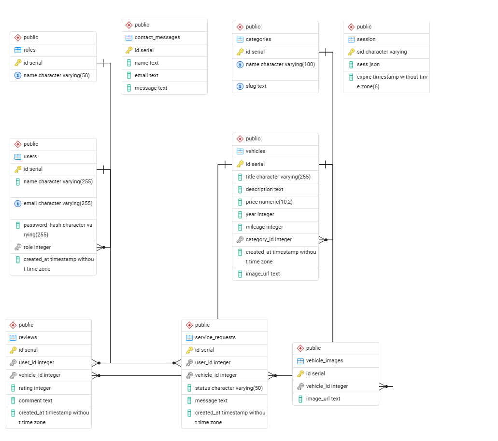

# Vehicles

# Vehicles

## Project Description

Vehicles is a server-side rendered used car dealership web application built with Node.js, Express, EJS, and PostgreSQL. The application allows users to browse vehicles, leave reviews, and submit service requests, while providing employees and owners with administrative tools to manage inventory, users, and service workflows.

The site is designed to demonstrate backend development concepts including authentication, authorization, relational database design, and multi-stage workflows.

---

## Database Schema

This diagram shows the normalized database structure, including relationships
between users, roles, vehicles, reviews, service requests, and related entities.

---

## User Roles

### Owner (Admin)
- Full access to the system
- Manage users and roles
- Add, edit, and delete vehicles
- Add, edit, and delete vehicle categories
- View and manage service requests
- View contact form submissions
- Moderate reviews

### Employee
- Edit vehicle details
- View and update service request status
- Add notes to service requests
- Moderate reviews
- View contact form submissions

### Standard User
- Register and log in
- Browse vehicles
- View vehicle details
- Leave reviews on vehicles
- Edit or delete their own reviews
- Submit service requests
- View service request history and status

---

## Test Account Credentials

The following test accounts are available for grading purposes.  
All accounts use the password: You should know the testing password! (see instructor)

- **Owner Account**
  - Email: owner@vehicles.com

- **Employee Account**
  - Email: employee@vehicles.com

- **User Account**
  - Email: user@vehicles.com

---

## Known Limitations

- Vehicle image uploads are currently limited to placeholder images. (If vehicle images fail to load)
- Pagination is not implemented on vehicle listings.
- The reviews.ejs edit form redirects back to the vehicle page using the vehicle ID stored on the review row; if the vehicle has been deleted the redirect goes to a 404.

## Getting started

Clone the repo and install dependencies:
npm install

Copy the environment template and fill in your values:
cp .env.example .env

## Start the development server:
npm start

## Technology Stack:
-Runtime: Node.js (ESM — no CommonJS)
-Framework: Express.js
-Views: EJS with partials
-Database: PostgreSQL via pg connection pool
-Auth: express-session + bcrypt password hashing
-Sessions: Persisted to PostgreSQL via connect-pg-simple
-Deployment: Render (web service + managed PostgreSQL)
